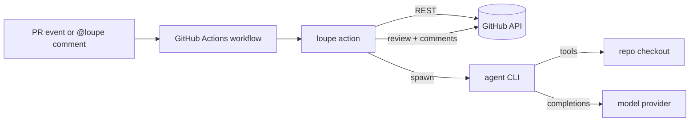

# How loupe works

loupe is a GitHub Action that reviews pull requests with an agentic coding CLI (whip, claude, or codex). A repo declares one or more focused **reviewers** in a `.loupe.json`, each with its own prompt and file globs. loupe runs every reviewer whose globs match a changed file and posts inline comments plus one persistent summary comment per reviewer.

Source: [context-labs/loupe](https://github.com/context-labs/loupe). loupe reviews its own PRs with [`.loupe/config.json`](../../.loupe/config.json).

## Read in this order

1. [Triggers](./triggers.md) — which GitHub events start a run, and what stops one. 2 min.
2. [A review run](./review-run.md) — the pipeline from event to posted review. 5 min.
3. [What the agent sees](./context.md) — system prompt, user prompt, skills, conventions, diff file. 4 min.
4. [GitHub objects](./github-objects.md) — reviews, inline comments, the summary comment, markers, delete and update rules. 5 min.
5. [First run vs later runs](./first-vs-incremental.md) — incremental review keyed on a SHA marker. 4 min.
6. [@loupe chat](./chat.md) — `review`, `fix`, `help`, and free-form questions. 3 min.
7. [Configuration](../configuration.md) — every knob in `.loupe.json`. Reference.

## 30-second picture

- **One job per PR event.** The recommended workflow groups concurrency by PR number so a new push cancels the in-flight review.
- **Reviewers run in parallel** inside that job. Each one scopes to its globs, runs its own agent, and posts its own review and summary comment.
- **The agent never talks to GitHub.** It reads the checkout and a diff file on disk and emits one JSON object. loupe's TypeScript owns every GitHub API call.
- **Blockers request changes.** Everything else is a `COMMENT` review. loupe never approves.
- **Advisory by design.** The recommended workflow runs with `continue-on-error: true` and is not a required check.

## Pinning

`uses: context-labs/loupe@main` runs the latest code. A tag or SHA pin freezes behavior, including the GitHub-object rules in these docs, at that point.
