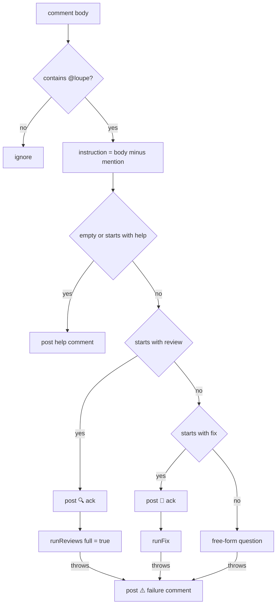
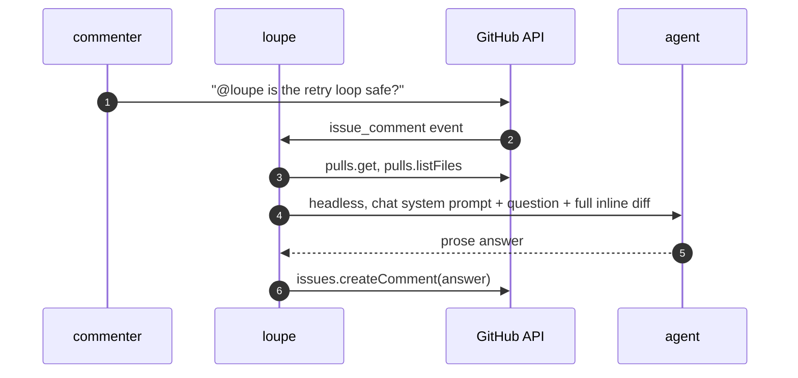

# @loupe chat


Any PR comment containing `@loupe` (case-insensitive, word boundary) starts the chat job. Review-thread comments count too. The text after the mention is the instruction.

## Dispatch



Every reply is a top-level issue comment via `issues.createComment`. Chat never edits or deletes anything.

## `@loupe review`

Same pipeline as a push, with `full` forced. See [First run vs later runs](./first-vs-incremental.md#forced-full-run). All configured reviewers run.

## `@loupe <question>`



Headless: no tools, no checkout access, whole PR diff inlined regardless of reviewer globs. No reviewer guidance, skills, or conventions are included. The answer is prose, not JSON.

## `@loupe fix <what>`

```mermaid
sequenceDiagram
    autonumber
    participant L as loupe
    participant GH as GitHub API
    participant G as git in checkout
    participant W as agent
    L->>GH: issues.createComment("🔧 On it")
    L->>GH: pulls.get
    alt head repo is a fork
        L->>GH: comment "can't push to a fork"
    else
        L->>G: fetch origin <head>; checkout -B <head> FETCH_HEAD
        L->>GH: pulls.listFiles
        L->>W: agentic, fix prompt + instruction + changed-file list
        W->>G: edit files
        L->>G: status --porcelain
        alt no changes
            L->>GH: comment "didn't make any changes"
        else
            L->>G: commit as loupe, push HEAD:<head> with token
            L->>GH: comment "✅ Pushed <sha>. Re-review with @loupe review"
        end
    end
```

- Commit message: `loupe: <first 60 chars of instruction>`. Author `loupe <loupe@users.noreply.github.com>`.
- The push does **not** trigger a new review run. Pushes made with the Actions token do not fire `pull_request` workflows. Ask for `@loupe review` after.
- A push rejected by branch protection posts a comment saying so. The chat job needs `contents: write`.

## Failure comment

Any thrown error after the ack posts:

```
⚠️ I couldn't complete the <review|fix|answer> — <first 500 chars of error>

See the Actions run logs for details.
```

Next: [Configuration](../configuration.md) for every knob, or back to the [index](./README.md).
