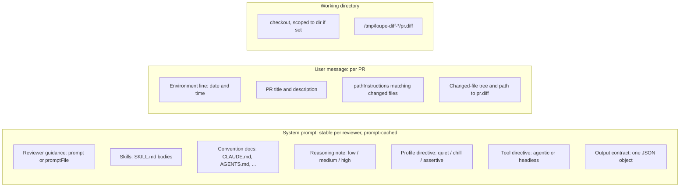

# What the agent sees

The agent gets two messages and a working directory. Nothing else. It has no GitHub token and no PR URL.

## Layout

## System prompt, in order

Order matters for caching. Everything here is identical across PRs for a given reviewer, so the provider reuses the cached prefix. `-cache-key loupe/<owner>/<repo>/<reviewer>` names that prefix.

1. **Guidance.** The reviewer's `prompt` or `promptFile`, verbatim. It replaces loupe's default guidance when set.
2. **Skills.** Each path in `skills` is read from the checkout. A directory means its `SKILL.md`. A missing skill logs a warning and is skipped.
3. **Conventions.** Every convention doc that exists at the PR head, concatenated under `# <path>` headers. Fetched via the GitHub API, not the checkout.
4. **Reasoning note.** One sentence.
5. **Profile directive.** Which severities to report.
6. **Tool directive.** Agentic: you have the checkout, read hunks from the diff file on demand, fan out subagents, confirm suspected blockers with a panel of different models, then stop and emit JSON. Headless (verify pass, retry, chat): no tools, diff is inline.
7. **Output contract.** One JSON object: `summary`, `concerns[]`, `highlights[]`, optional `diagram`, `findings[]` with `path`, `line` (new-file line, must be in the diff), `severity`, `body`.

## User message

- Environment line with the current date and time in the configured `timezone`.
- PR title and body.
- `pathInstructions` whose glob matches at least one in-scope file, one bullet each.
- **Agentic:** a tree of changed files and the absolute path of `pr.diff`. The diff is not inlined so it is not re-sent on every turn.
- **Headless:** the full rendered diff, `### <path>` then the unified patch.

## What is in the diff file

Only the files in scope for this reviewer and this run. On an incremental run that is the delta since the last reviewed SHA, not the whole PR. See [First run vs later runs](./first-vs-incremental.md).

## What is not there

- No GitHub credentials, PR number, or API access. The agent cannot post or read comments.
- No prior loupe findings. Each run reviews fresh.
- No files outside `dir` when it is set. The working directory is the subdir.
- Severities outside the profile, even if emitted. The filter runs after parsing.

Next: [GitHub objects](./github-objects.md).
