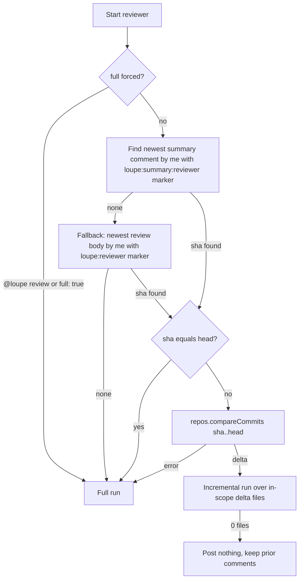
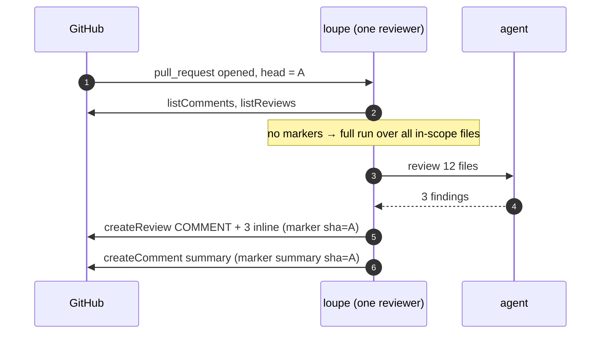
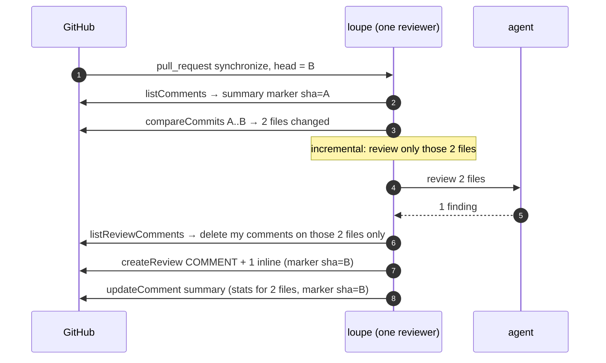

# First run vs later runs

The only state loupe keeps is a SHA inside its own comments. Each reviewer keeps its own.

## Decision

The "sha equals head" case happens on `reopened` or `ready_for_review` with no new commits, and on a manual re-run. Treating it as a full run means the review is recomputed and replaced, not skipped.

## First run

## Second push

Comments on the other 10 files from the first run are untouched. GitHub shows them as outdated if their lines moved.

## Push that changes nothing in scope

Head moves to C, `compareCommits B..C` returns only files outside this reviewer's globs. The reviewer logs "keeping prior comments" and makes no writes. The summary still says `sha=B`, so the next push compares from B, not C.

## Forced full run

`@loupe review` calls the same pipeline with `full = true`. Every in-scope file is reviewed, every prior inline comment for this reviewer is deleted, and the summary is rewritten with a fresh stat line.

## Consequences worth knowing

- **The summary stat line reflects the last run only.** After an incremental run over 2 files it says "2 files", not the PR total.
- **A stale `REQUEST_CHANGES` review persists.** Fixing the blocker and pushing yields a new `COMMENT` review. The old request stays until dismissed.
- **Deleting the summary comment resets the reviewer to first-run behavior** on the next push, unless an older review body still carries a marker.
- **N reviewers, N SHAs.** A reviewer whose globs never matched has no summary on the PR, so its first match is a full run.

Next: [@loupe chat](./chat.md).
