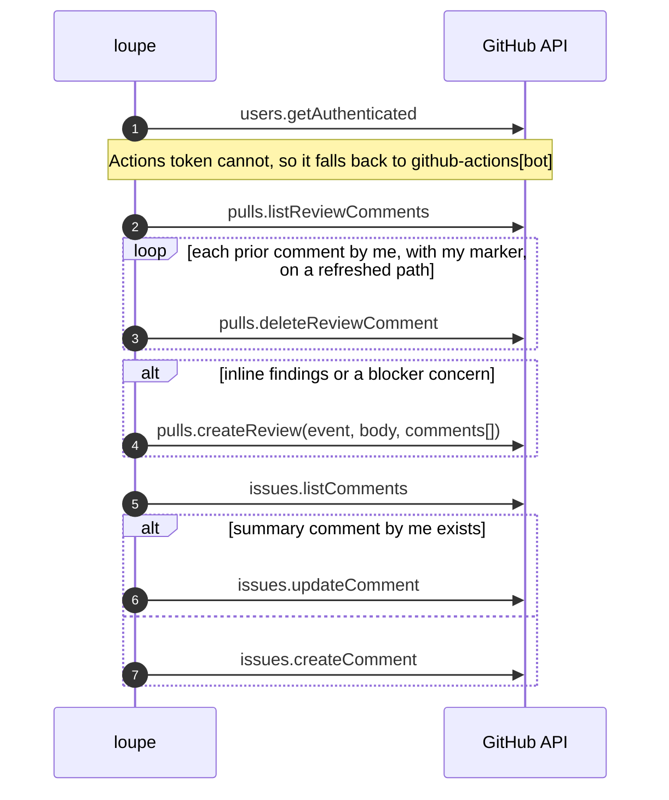
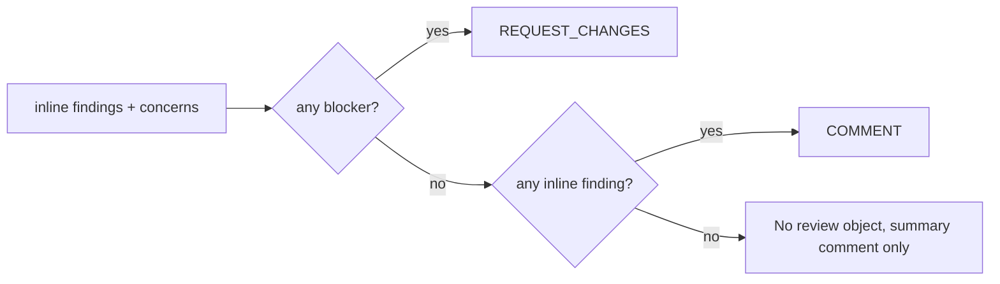

# GitHub objects


Three kinds of object, all owned by loupe's TypeScript, never by the agent.

| Object | API | Per run | Marker |
| --- | --- | --- | --- |
| Pull request review | `pulls.createReview` | 0 or 1, only if there are inline findings or a blocker | `<!-- loupe:<reviewer> sha=<head> -->` in the body when no inline comments |
| Inline review comment | created inside the review above, deleted via `pulls.deleteReviewComment` | n | Same marker appended to every comment body |
| Summary issue comment | `issues.createComment` first time, `issues.updateComment` after | exactly 1, updated in place | `<!-- loupe:summary:<reviewer> sha=<head> -->` |

`<reviewer>` is the reviewer's `name` (or `default` with no config), so reviewers never touch each other's objects.

## The posting sequence



## Review verdict



- **`REQUEST_CHANGES`** counts as a blocking review in the PR UI until dismissed. A later run with no blockers posts a `COMMENT` review, which does not dismiss the earlier request. Dismiss it by hand.
- **Never `APPROVE`.** A bot must not satisfy a required-approver rule.
- **Review body** is empty when there are inline comments. GitHub requires some body when there are none, so a blocker-only review carries just the marker.

## Inline comment body

```
🔴 **blocker** <finding body>

<!-- loupe:<reviewer> sha=<head> -->
```

Severity emoji: 🔴 blocker, 🟡 warning, 🔵 nit.

## Summary comment body

~~~
### 🔍 loupe · <reviewer>

🔴 1 · 🟡 2 · 4 files

<summary from the agent>

#### Concerns
- 🟡 **title** — detail

#### Highlights
- ✅ ...

_3 inline comments on the diff below._

```mermaid   (only if the agent returned a diagram)
...
```

<details><summary>Other notes (n)</summary> off-diff findings </details>

Last reviewed commit: [`abc1234`](link)

<!-- loupe:summary:<reviewer> sha=<head> -->
~~~

In ensemble mode, minority findings sit in a second `<details>` block titled "Lower-confidence findings".

## Author guard

A marker in a comment body is not proof loupe wrote it. A person quoting a loupe comment carries the marker too. Every "is this mine" check pairs the marker with the login from `users.getAuthenticated`, or `github-actions[bot]` when that call fails, which it does for the default Actions token. Only comments under that login are deleted or read for the last-reviewed SHA.

## What gets deleted

- **Full run:** every inline comment by loupe with this reviewer's marker.
- **Incremental run:** only those on files in the delta. Comments on files unchanged since the last review stay.
- **Never:** the summary comment (updated in place), reviews themselves (GitHub does not allow deleting reviews), human comments, other reviewers' comments.

Cleanup is best-effort. A failure logs a warning and posting proceeds, which can leave a duplicate.

Next: [First run vs later runs](./first-vs-incremental.md).
