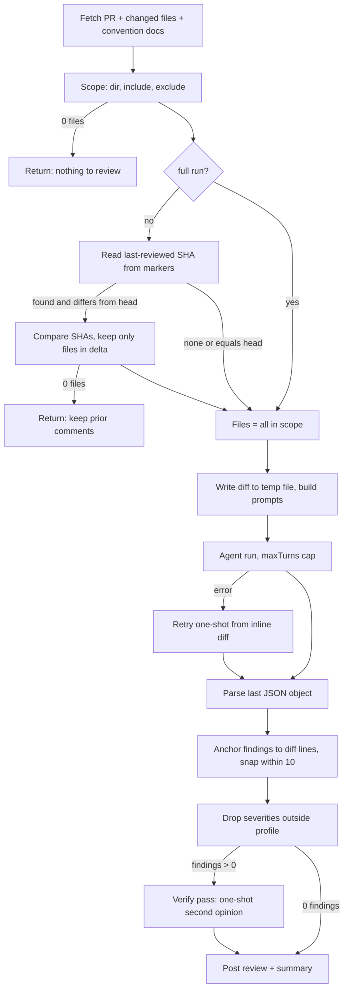
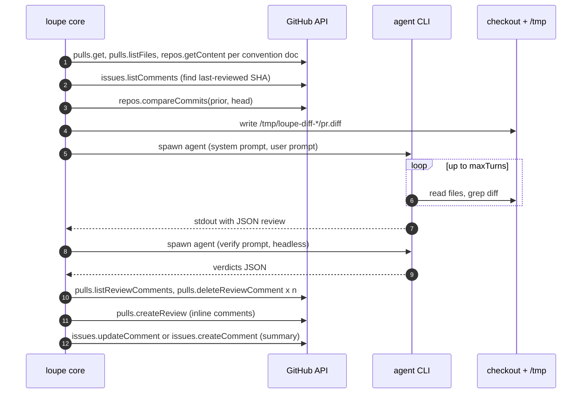

# A review run

`runReviews` fans out one `runReview` per reviewer in `.loupe.json`, in parallel. Everything below happens once per reviewer. Code: `packages/core/src/index.ts`.

## Pipeline

## Step by step

1. **Fetch.** GitHub reads in parallel: `pulls.get`, `pulls.listFiles` (paginated, with patches), and `repos.getContent` for each convention doc at the PR head. Convention paths default to `CLAUDE.md, AGENTS.md, .loupe.md, CONTRIBUTING.md`, prefixed with `dir` when set.
2. **Scope.** Keep files under `dir` that match the reviewer's `include` and miss its `exclude`. Zero files means the reviewer is skipped with no GitHub writes.
3. **Incremental or full.** See [First run vs later runs](./first-vs-incremental.md). Default is incremental. `@loupe review` and the `full` input force full.
4. **Prompts.** The diff is rendered as `### <path>` sections and written to a temp file. The user prompt carries a file tree plus that path. See [What the agent sees](./context.md).
5. **Run the agent.** For whip: `whip run --format json -quiet -no-session -max-turns <n> -system <prompt> -m <model> -cache-key loupe/<owner>/<repo>/<reviewer>`, prompt on stdin, in a throwaway `WHIP_HOME` built from the config's `whip` block. `claude` and `codex` get the equivalent flags. If the agentic run throws, loupe retries once headless with the full diff inlined so something still posts.
6. **Parse.** The last `{...}` in stdout is the review. Each finding is validated on its own, so one malformed entry is dropped rather than failing the run. Off-scale severities (`critical`, `minor`, ...) map onto blocker, warning, nit.
7. **Anchor.** GitHub only accepts inline comments on lines present in the diff. A finding on an exact diff line stays inline. One within 10 lines snaps to the nearest diff line. Anything else, or on a file not in scope, becomes an off-diff note in the summary.
8. **Profile filter.** `quiet` keeps blockers, `chill` (default) keeps blockers and warnings, `assertive` keeps everything.
9. **Verify.** If any inline findings survived and `verify` is on (default), one more headless call asks the same model to mark each `real: true|false`. Findings judged not real are dropped. Any error keeps them all. An `ensemble` replaces this step: findings a majority of models agree on are kept, minority findings go to a collapsed section.
10. **Post.** See [GitHub objects](./github-objects.md).

## Limits

| Knob | Default | Effect |
| --- | --- | --- |
| `maxTurns` | 10 | Agentic tool-loop cap, per reviewer or top level |
| headless cap | 10, fixed | Safety net for the verify pass and the one-shot retry |
| `reasoning` | low | Changes one sentence in the system prompt, nothing else |

Hitting `maxTurns` mid-exploration is an error from the harness, which triggers the headless retry.

## Sequence, single reviewer, happy path

Next: [What the agent sees](./context.md).
